class: title

# The Survival Guide of Building Huge App

10x Faster Dev/Verification Cycle

CJ Lin

---

## Let's do a little survey...
--

### Can't tolerate LONG BUILD TME?
--

### Let's solve it !!!

---

## About me

.left-column-80[
```swift
struct Profile {

    let name = "CJ Lin"

    var identity = "iOS Nerd"

    var company = "LINE"

    var blog = "https://ejameslin.github.io"

    var line = "ejameslin"

    var twitter = "@eJamesLin"

}
```
]

.right-column-20[

]

???

List of App

---

## Build Time
--

### Main Target

.center[
	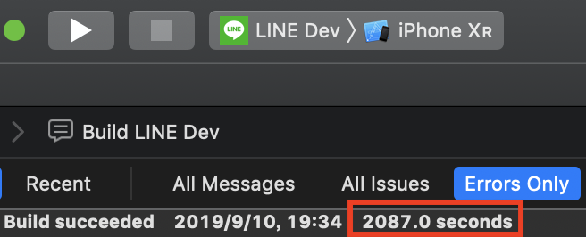
]

--

### Partitioned Framework Target

.center[
	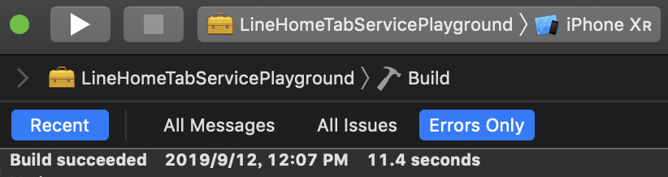
]

???

Build time quickly disappear for indexing after build at Xcode title bar...

---

## Framework Partitioning Tips

.center[
	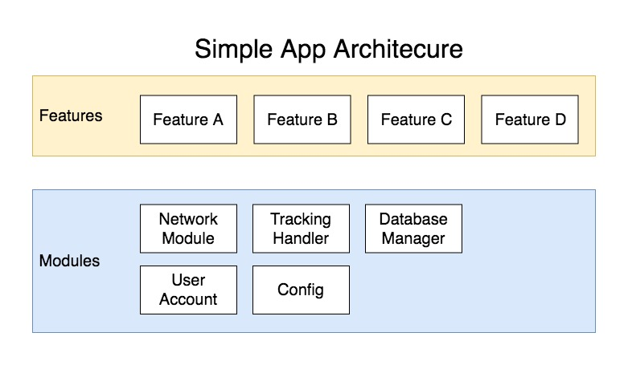
]

---

## Framework Partitioning Tips

.center[
	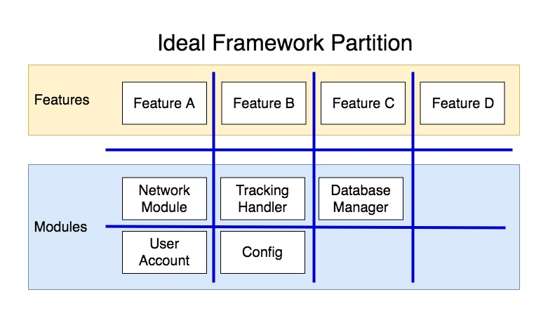
]

---

## Framework Partitioning Tips

.center[
	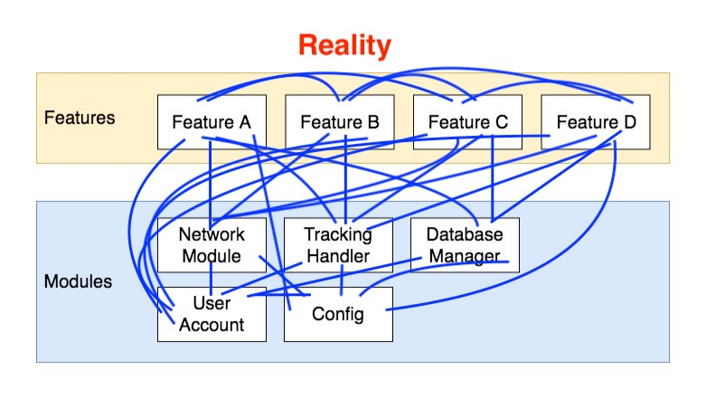
]

---

class: blank

.vertical-center.center[
## Small Testing-Only Framework
]

---

## Small Testing-Only Framework

### Just start partitioning
--

### Don't worry about architecture

---

## Small Testing-Only Framework

* Build Fast
	* Feature related code only
	* Few compile source count

--

.right-column-20[
	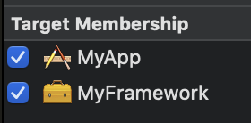
]

* Testing-Only
	* Code in both targets
	* Not embedded in others
	* Not linked by others

---

## Framework Partitioning Tips

### Coordinator / Router

### Dependency Injection

---

## Coordinator / Router

### How `Coordinator` eliminate dependency?

* Example
	1. In `Profile`
	2. Click `Edit` button
	3. Show `EditProfile`
--

* If show `EditProfile` directly in `Profile` class
	* `Profile` is depends on `EditProfile`
	* Difficult to move into framework

---

## Coordinator / Router

```swift
class Coordinator: ProfileViewControllerDelegate {
	viewControllerDidSelectEdit(_ vc: ProfileViewController) {
		// show EditProfileViewController...
	}
}
```

```swift
protocol ProfileViewControllerDelegate: class {
	viewControllerDidSelectEdit(_ vc: ProfileViewController) {}
}

class ProfileViewController: UIViewController {
	weak var delegate: ProfileViewControllerDelegate?
}
```

.center[
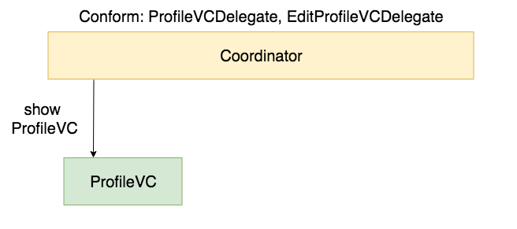
]

---

## Coordinator / Router

```swift
class Coordinator: ProfileViewControllerDelegate {
	viewControllerDidSelectEdit(_ vc: ProfileViewController) {
		// show EditProfileViewController...
	}
}
```

```swift
protocol ProfileViewControllerDelegate: class {
	viewControllerDidSelectEdit(_ vc: ProfileViewController) {}
}

class ProfileViewController: UIViewController {
	weak var delegate: ProfileViewControllerDelegate?
}
```

.center[
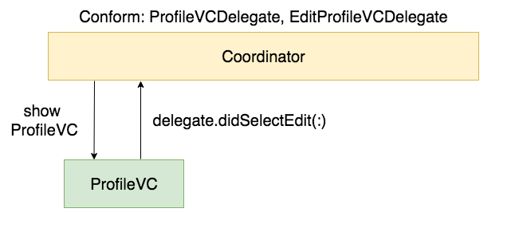
]

---

## Coordinator / Router

```swift
class Coordinator: ProfileViewControllerDelegate {
	viewControllerDidSelectEdit(_ vc: ProfileViewController) {
		// show EditProfileViewController...
	}
}
```

```swift
protocol ProfileViewControllerDelegate: class {
	viewControllerDidSelectEdit(_ vc: ProfileViewController) {}
}

class ProfileViewController: UIViewController {
	weak var delegate: ProfileViewControllerDelegate?
}
```

.center[
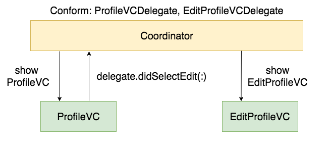
]

---

## Dependency Injection

---

class: blank

.vertical-center.center[
## Framework + Live View
]

---

## Framework + Live View

### SwiftUI Canvas Preview

### Playground

---

## SwiftUI Canvas Preview Advantage
--

.left-column[
.font-large[Live Preview]
]

.right-column[
* Interactable
]
--

.right-column[
* Can also preview UIViewController / UIView
]

---

## SwiftUI Canvas Preview Advantage

.left-column[
.font-large.grey[Live Preview]

.font-large[Fast Access]
]

.right-column[
* Render the page directly

* No need following steps
1. Select A
2. Scroll
3. Click B
4. ...
]

---

## SwiftUI Canvas Preview Advantage

.left-column[
.font-large.grey[Live Preview]

.font-large.grey[Fast Access]

.font-large[Preview device size]
]

.right-column[
```swift
struct ContentView_Previews: PreviewProvider {
    static var previews: some View {
        ContentView()
        	.previewDevice("iPhone 11")
    }
}
```
]

---

## SwiftUI Canvas Preview Advantage

.left-column[
.font-large.grey[Live Preview]

.font-large.grey[Fast Access]

.font-large.grey[Preview device size]

.font-large[Group Preview]
]

.right-column[
```
struct ContentView_Previews: PreviewProvider {
    static var previews: some View {
        Group {
            ContentView()
            	.previewDevice("iPhone SE")

            ContentView()
            	.previewDevice("iPhone 11")
        }
    }
}
```
]

---

## SwiftUI Canvas Preview Advantage

.left-column[
.font-large.grey[Live Preview]

.font-large.grey[Fast Access]

.font-large.grey[Preview device size]

.font-large.grey[Group Preview]

.font-large[Vary Language]
]

.right-column[
```
struct SwiftUIText: View {
    var body: some View {
        Text("HelloKey")
    }
}
struct PreviewSwiftUIText: PreviewProvider {
    static var previews: some View {
        Group {
            SwiftUIText()
            .environment(\.locale, 
                		 Locale(identifier: "en"))
            .previewDisplayName("en")

            SwiftUIText()
	        .environment(\.locale, 
	            	     Locale(identifier: "ja"))
	        .previewDisplayName("ja")
        }
        .previewLayout(.sizeThatFits)
    }
}
```
]

.left-column[
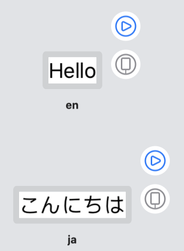
]

---

## SwiftUI Canvas Preview Advantage

.left-column[
.font-large.grey[Live Preview]

.font-large.grey[Fast Access]

.font-large.grey[Preview device size]

.font-large.grey[Group Preview]

.font-large[Vary Language]
]

.right-column[
### Not work at `NSLocalizedString`
]

---

## SwiftUI Preview + NSLocalizedString

.center[
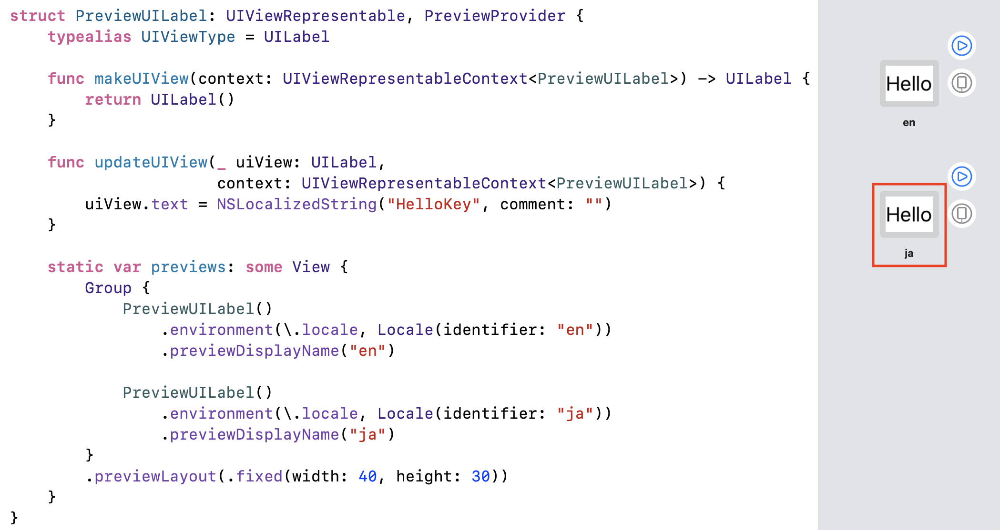
]

---

## SwiftUI Canvas Preview + Framework

### Known Issue

```
Previews in packages always perform a full build of the active scheme. (51030302)
```
.footnote[[Xcode 11 Release Notes](https://developer.apple.com/documentation/xcode_release_notes/xcode_11_release_notes)]

.center[
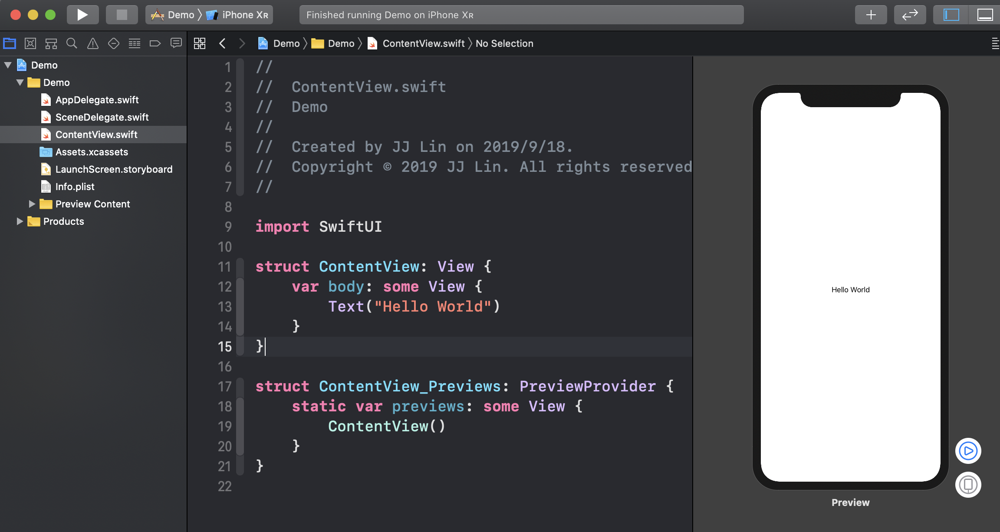
]

---

## SwiftUI Canvas Preview + Framework

```
Previews in packages always perform a full build of the active scheme. (51030302)
```

Main Scheme

.center[
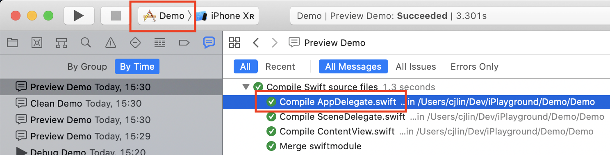
]

--

Framework Scheme

.center[
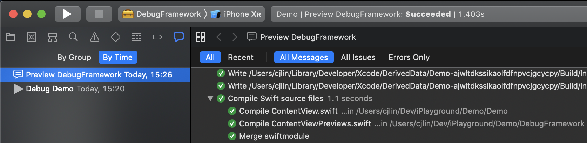
]

---

## Playground + Framework

.center[
	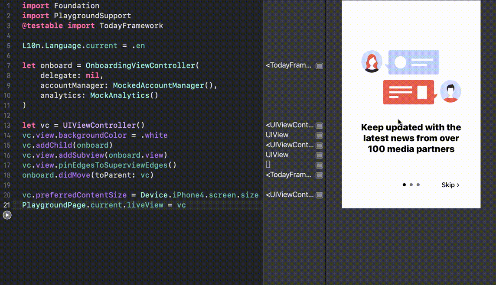
]

---

## Playground Advantage

.left-column[
.font-large[Live View]
]

.right-column[
* Interactable
]

---

## Playground Advantage

.left-column[
.font-large.grey[Live View]

.font-large[Fast Access]
]

.right-column[
* Render the page directly

* No need following steps
1. Select A
2. Scroll
3. Click B
4. ...
]

---

## Playground Advantage

.left-column[
.font-large.grey[Live View]

.font-large.grey[Fast Access]

.font-large[Inline Display]
]

.right-column[
	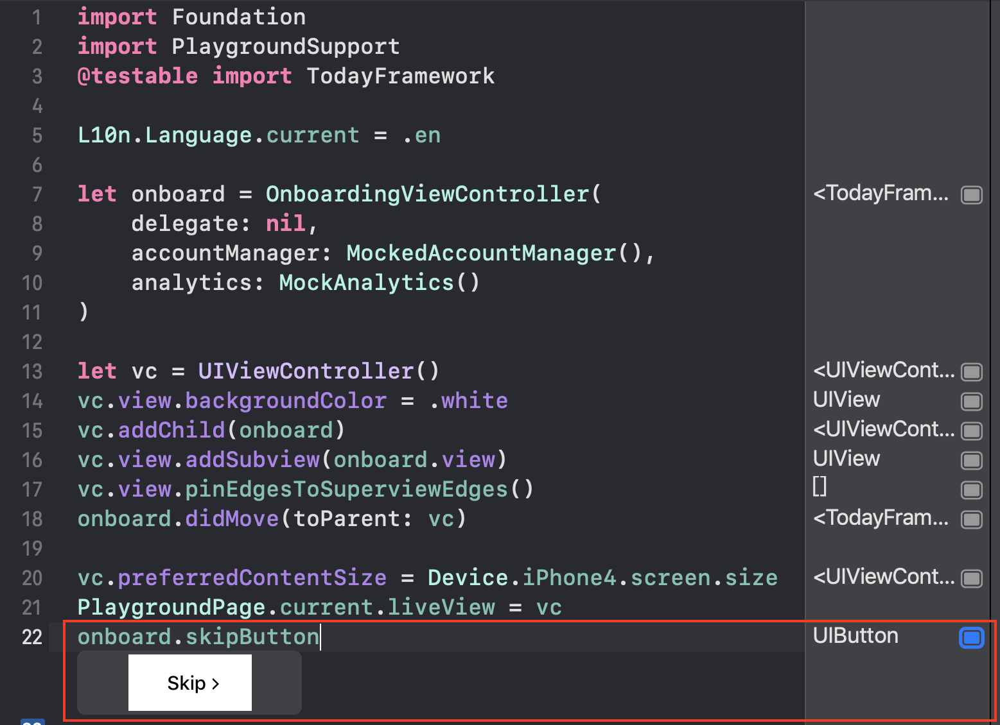
]

---

## Playground Advantage

.left-column[
.font-large.grey[Live View]

.font-large.grey[Fast Access]

.font-large.grey[Inline Display]

.font-large[Run Step by Step]
]

.right-column[
* View change on the fly

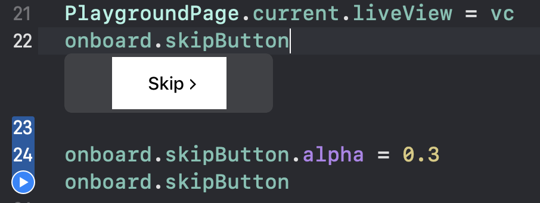
]
--

.right-column[
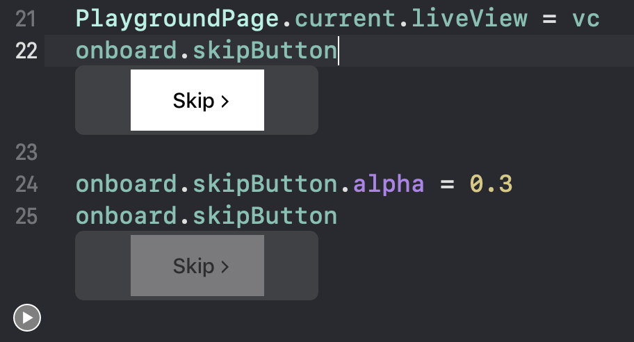
]

???

Similar to Scripting Language

---

## Playground Advantage

.left-column[
.font-large.grey[Live View]

.font-large.grey[Fast Access]

.font-large.grey[Inline Display]

.font-large[Run Step by Step]
]

.right-column[
* View change on the fly
]
.right-column[
* Perfect for network response decoding trial
]

---

## Playground Advantage

.left-column[
.font-large.grey[Live View]

.font-large.grey[Fast Access]

.font-large.grey[Inline Display]

.font-large.grey[Run Step by Step]

.font-large[Vary Screen Size]
]

.right-column[
```swift
viewController.preferredContentSize = Some Size
```
]

---

## Playground Advantage

.left-column[
.font-large.grey[Live View]

.font-large.grey[Fast Access]

.font-large.grey[Inline Display]

.font-large.grey[Run Step by Step]

.font-large.grey[Vary Screen Size]

.font-large[Vary Language]
]

.right-column[
* Use `NSLocalizedString` with specified language sub-bundle
]

---

## Custom framework in playground

* Objetive-C framework supported
	* Add bridging header
--

* CocoaPods/Carthage supported

???

Add more detail if still have time

---

## Custom framework in playground

1. Add the playground into the workspace
--

2. `import` or `@testable import` the framework
	with Testability enabled in settings
--

3. Build the framework
--

4. Start playgrounding
--


.footnote[[Apple Document](https://help.apple.com/xcode/mac/9.0/#/devc9b33111c)]

---

## Playground Driven Development

* From Kickstarter [Open Source](https://github.com/kickstarter/ios-oss) and [Speech](https://www.youtube.com/watch?v=DrdxSNG-_DE)
* All code in Framework
* Every page inspectable in playground

.center[
	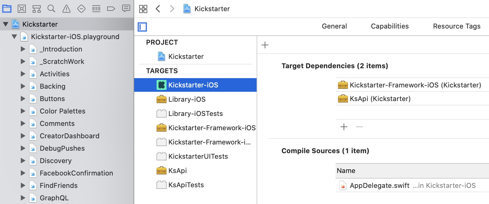
]

---

## Outline

### Framework + Playground

### Playground Advantage

### Playground Tips

### Framework Partitioning Tips

### LLDB

---

## Build and Run no more!

.vertical-center.center[
# Thank you
]
