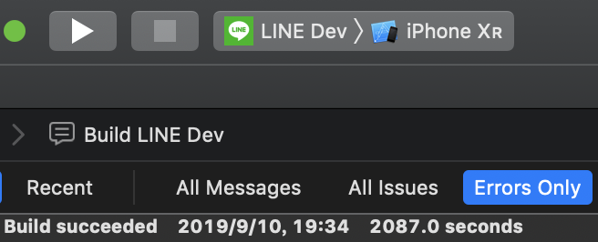

class: title

# The Survival Guide of Building Huge App

10x Faster Dev/Verification Cycle

CJ Lin

---

## Let's do a little survey...
--

### Can't tolerate LONG BUILD TME?
--

### Let's solve it !!!

---

## About me

.left-column-80[
```swift
struct Profile {

    let name = "CJ Lin"

    var identity = "iOS Nerd"

    var company = "LINE"

    var blog = "https://ejameslin.github.io"

    var line = "ejameslin"

    var twitter = "@eJamesLin"

}
```
]

.right-column-20[

]

???

List of App

---

## Build whole APP is slow, but Partition?
--

### Whole APP

.center[
	
]

???

Build time quickly disappear for indexing after build at Xcode title bar...

--

### A partition

???

Add image here

---

## Framework + Playground

.center[
	
]

---

## Playground Advantage

.left-column[
.font-large[Live View]
]

.right-column[
* Interactable
]

---

## Playground Advantage

.left-column[
.font-large.grey[Live View]

.font-large[Inline Display]
]

.right-column[
	
]

---

## Playground Advantage

.left-column[
.font-large.grey[Live View]

.font-large.grey[Inline Display]

.font-large[Run Step by Step]
]

.right-column[
* View change on the fly


]
--

.right-column[

]

???

Similar to Scripting Language

---

## Playground Advantage

.left-column[
.font-large.grey[Live View]

.font-large.grey[Inline Display]

.font-large[Run Step by Step]
]

.right-column[
* View change on the fly
]
.right-column[
* Perfect for network response decoding trial
]

---

## Playground Advantage

.left-column[
.font-large.grey[Live View]

.font-large.grey[Inline Display]

.font-large.grey[Run Step by Step]

.font-large[Vary Screen Size]
]

.right-column[
```swift
viewController.preferredContentSize = Some Size...
```
]

---

## Playground Advantage

.left-column[
.font-large.grey[Live View]

.font-large.grey[Inline Display]

.font-large.grey[Run Step by Step]

.font-large.grey[Vary Screen Size]

.font-large[Vary Language]
]

.right-column[
* Use `NSLocalizedString` with specified language sub-bundle
]

---

## Playground Advantage

.left-column[
.font-large.grey[Live View]

.font-large.grey[Inline Display]

.font-large.grey[Run Step by Step]

.font-large.grey[Vary Screen Size]

.font-large.grey[Vary Language]

.font-large[Fast Access]
]

.right-column[
* Render the page directly
]
--
.right-column[
* No more `Select A`, then `Scroll`, and then `Click B` in order to access some page
]

---

## Custom framework in playground

* Objetive-C framework supported
	* Add bridging header
--

* CocoaPods/Carthage supported

???

Add more detail if still have time

---

## Custom framework in playground

1. Add the playground into the workspace
--

2. `import` or `@testable import` the framework
	with Testability enabled in settings
--

3. Build the framework
--

4. Start playgrounding
--


.footnote[[Apple Document](https://help.apple.com/xcode/mac/9.0/#/devc9b33111c)]

---

## Outline

### Framework + Playground

### Playground Advantage

### Playground Tips

### Framework Partitioning Tips

### LLDB

---

## Framework Partitioning Tips

.center[
	
]

---

## Framework Partitioning Tips

.center[
	
]

---

## Framework Partitioning Tips

.center[
	
]

---

## Framework Partitioning Tips

### Coordinator / Router

### Dependency Injection

---

## Coordinator / Router

### How `Coordinator` eliminate dependency?

* Example
	* In `Profile`, click `Edit` button, and show `EditProfile`
--

* If show `EditProfile` directly in `Profile` class
	* `Profile` is depends on `EditProfile`
	* Difficult to move into framework

---

## Coordinator / Router

```swift
class Coordinator: ProfileViewControllerDelegate {
	viewControllerDidSelectEdit(_ vc: ProfileViewController) {
		// show EditProfileViewController...
	}
}
```

```swift
protocol ProfileViewControllerDelegate: class {
	viewControllerDidSelectEdit(_ vc: ProfileViewController) {}
}

class ProfileViewController: UIViewController {
	weak var delegate: ProfileViewControllerDelegate?
}
```

.center[

]

---

## Coordinator / Router

```swift
class Coordinator: ProfileViewControllerDelegate {
	viewControllerDidSelectEdit(_ vc: ProfileViewController) {
		// show EditProfileViewController...
	}
}
```

```swift
protocol ProfileViewControllerDelegate: class {
	viewControllerDidSelectEdit(_ vc: ProfileViewController) {}
}

class ProfileViewController: UIViewController {
	weak var delegate: ProfileViewControllerDelegate?
}
```

.center[

]

---

## Coordinator / Router

```swift
class Coordinator: ProfileViewControllerDelegate {
	viewControllerDidSelectEdit(_ vc: ProfileViewController) {
		// show EditProfileViewController...
	}
}
```

```swift
protocol ProfileViewControllerDelegate: class {
	viewControllerDidSelectEdit(_ vc: ProfileViewController) {}
}

class ProfileViewController: UIViewController {
	weak var delegate: ProfileViewControllerDelegate?
}
```

.center[

]

---

## Dependency Injection

---

## References

* https://help.apple.com/xcode/mac/9.0/#/devc9b33111c

* https://medium.com/flawless-app-stories/playground-driven-development-in-swift-cf167489fe7b

---

## Build and Run no more!

.vertical-center.center[
# Thank you
]
