class: title

# The Survival Guide of Building Huge App

10x Faster Dev/Verification Cycle

CJ Lin

???

This talk is not about lower overall build time

It's about tips of faster dev/verification cycle

Let's start it!

---

## Let's do a little survey...

???

App build time > 10 mins
--

### Can't tolerate LONG BUILD TME?
--

### Let's solve it !!!

---

## About me

.left-column-80[
```swift
struct Profile {

    let name = "CJ Lin"

    var identity = "iOS Nerd"

    var company = "LINE"

    var blog = "https://ejameslin.github.io"

    var github = "https://github.com/eJamesLin"

    var line = "ejameslin"

    var twitter = "@eJamesLin"
}
```


]

.right-column-20[

]

---

## Build Time

### Main Target

.center[
	
]

--

### Partitioned Framework Target

.center[
	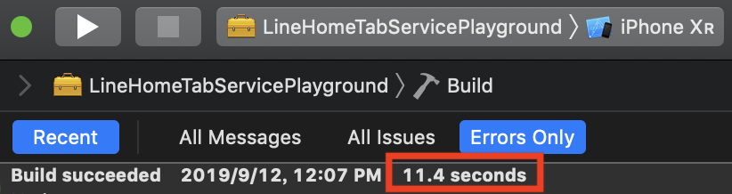
]

???

Build time quickly disappear for indexing after build at Xcode title bar...

---

## Framework Partitioning Tips

.center[
	
]

---

## Framework Partitioning Tips

.center[
	
]

---

## Framework Partitioning Tips

.center[
	
]

---

## Let's start from small step

.vertical-center.center[
### Ideal partition is too ideal
]

---

## Let's start from small step

.vertical-center.center[
### Small Testing-Only Framework
]

---

## Small Testing-Only Framework

* Build Fast
	* Feature related code only
	* Few compile source count

--

.right-column-20[
	
]

* Testing-Only
	* Code in both targets
	* Not embedded in others
	* Not linked by others
--

* Easy to apply on existing project

---

## Framework Partitioning Tips

### Coordinator / Router

### Dependency Injection

---

## Coordinator / Router

### How `Coordinator` eliminate dependency?

* Example
	1. In `Profile`
	2. Click `Edit` button
	3. Show `EditProfile`
--

* `Profile` is depends on `EditProfile`
--

* Difficult to move into framework

---

## Coordinator / Router

```swift
class Coordinator: ProfileViewControllerDelegate {
	viewControllerDidSelectEdit(_ vc: ProfileViewController) {
		// show EditProfileViewController...
	}
}
```

```swift
protocol ProfileViewControllerDelegate: class {
	viewControllerDidSelectEdit(_ vc: ProfileViewController) {}
}

class ProfileViewController: UIViewController {
	weak var delegate: ProfileViewControllerDelegate?
}
```

.center[

]

---

## Coordinator / Router

```swift
class Coordinator: ProfileViewControllerDelegate {
	viewControllerDidSelectEdit(_ vc: ProfileViewController) {
		// show EditProfileViewController...
	}
}
```

```swift
protocol ProfileViewControllerDelegate: class {
	viewControllerDidSelectEdit(_ vc: ProfileViewController) {}
}

class ProfileViewController: UIViewController {
	weak var delegate: ProfileViewControllerDelegate?
}
```

.center[

]

---

## Coordinator / Router

```swift
class Coordinator: ProfileViewControllerDelegate {
	viewControllerDidSelectEdit(_ vc: ProfileViewController) {
		// show EditProfileViewController...
	}
}
```

```swift
protocol ProfileViewControllerDelegate: class {
	viewControllerDidSelectEdit(_ vc: ProfileViewController) {}
}

class ProfileViewController: UIViewController {
	weak var delegate: ProfileViewControllerDelegate?
}
```

.center[

]

---

## Dependency Injection Example
--

```
enum AnalyticsScreen {
    case feed
}
protocol AnalyticsProtocol {
    func track(screen: AnalyticsScreen)
}
```

???

Start from `AnalyticsProtocol` definition
--

```
class Analytics: AnalyticsProtocol {
    func track(screen: AnalyticsScreen) {
        GA.track(screen: screen)
    }
}
```

???

`Analytics` conforms to the protocol
--

```
class FeedController: UIViewController {
    let analytics: AnalyticsProtocol
    init(analytics: AnalyticsProtocol) {
        self.analytics = analytics
        super.init(nibName: nil, bundle: nil)
    }
    override func viewDidLoad() {
        super.viewDidLoad()
        analytics.track(screen: .feed)
    }
```

???

Controller is now depends on only the protocol,
not the `Analytics`, nor the implementation detail GA.

---

class: blank

.vertical-center.center[
## Framework + Live View
]

---

## Framework + Live View

### SwiftUI Canvas Preview

### Playground

---

## SwiftUI Canvas Preview Advantage
--

.left-column[
.font-large[Live Preview]
]

.right-column[
* Interactable
]
--

.right-column[
* Can also preview UIViewController / UIView
]

---

## SwiftUI Canvas Preview Advantage

.left-column[
.font-large.grey[Live Preview]

.font-large[Fast Access]
]

.right-column[
* Render the page directly

* No need following steps
1. Select A
2. Scroll
3. Click B
4. ...
]

---

## SwiftUI Canvas Preview Advantage

.left-column[
.font-large.grey[Live Preview]

.font-large.grey[Fast Access]

.font-large[Preview device size]
]

.right-column[
```swift
struct ContentView_Previews: PreviewProvider {
    static var previews: some View {
        ContentView()
        	.previewDevice("iPhone 11")
    }
}
```
]

---

## SwiftUI Canvas Preview Advantage

.left-column[
.font-large.grey[Live Preview]

.font-large.grey[Fast Access]

.font-large.grey[Preview device size]

.font-large[Group Preview]
]

.right-column[
```
struct ContentView_Previews: PreviewProvider {
    static var previews: some View {
        Group {
            ContentView()
            	.previewDevice("iPhone SE")

            ContentView()
            	.previewDevice("iPhone 11")
        }
    }
}
```
]

---

## SwiftUI Canvas Preview Advantage

.left-column[
.font-large.grey[Live Preview]

.font-large.grey[Fast Access]

.font-large.grey[Preview device size]

.font-large.grey[Group Preview]

.font-large[Vary Language]
]

.right-column[
```
struct SwiftUIText: View {
    var body: some View {
        Text("HelloKey")
    }
}
struct PreviewSwiftUIText: PreviewProvider {
    static var previews: some View {
        Group {
            SwiftUIText()
            .environment(\.locale, 
                		 Locale(identifier: "en"))
            .previewDisplayName("en")

            SwiftUIText()
	        .environment(\.locale, 
	            	     Locale(identifier: "ja"))
	        .previewDisplayName("ja")
        }
        .previewLayout(.sizeThatFits)
    }
}
```
]

.left-column[

]

---

## SwiftUI Canvas Preview Advantage

.left-column[
.font-large.grey[Live Preview]

.font-large.grey[Fast Access]

.font-large.grey[Preview device size]

.font-large.grey[Group Preview]

.font-large[Vary Language]
]

.right-column[
### Not work at `NSLocalizedString`
]

---

## SwiftUI Preview + NSLocalizedString

.center[

]

---

## SwiftUI Canvas Preview + Framework

### Known Issue

```
Previews in packages always perform a full build of the active scheme. (51030302)
```
.footnote[[Xcode 11 Release Notes](https://developer.apple.com/documentation/xcode_release_notes/xcode_11_release_notes)]

.center[
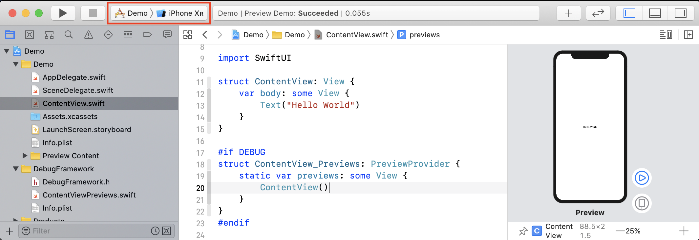
]

---

## SwiftUI Canvas Preview + Framework

```
Previews in packages always perform a full build of the active scheme. (51030302)
```

Main Scheme

.center[

]

--

Framework Scheme

.center[
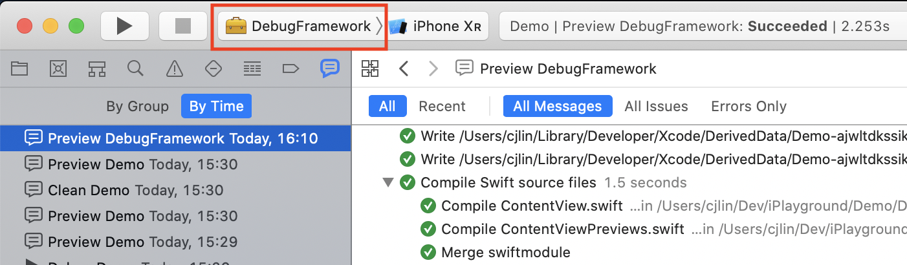
]

---

## Playground + Framework

.center[
	
]

---

## Playground + Framework

* Objetive-C framework supported
	* Add bridging header
--

* CocoaPods/Carthage supported

???

Add more detail if still have time

---

## Playground Advantage

.left-column[
.font-large[Live View]
]

.right-column[
* Interactable
]

---

## Playground Advantage

.left-column[
.font-large.grey[Live View]

.font-large[Fast Access]
]

.right-column[
* Render the page directly

* No need following steps
1. Select A
2. Scroll
3. Click B
4. ...
]

---

## Playground Advantage

.left-column[
.font-large.grey[Live View]

.font-large.grey[Fast Access]

.font-large[Inline Display]
]

.right-column[
	
]

---

## Playground Advantage

.left-column[
.font-large.grey[Live View]

.font-large.grey[Fast Access]

.font-large.grey[Inline Display]

.font-large[Run Step by Step]
]

.right-column[
* View change on the fly


]
--

.right-column[

]

???

Similar to Scripting Language

---

## Playground Advantage

.left-column[
.font-large.grey[Live View]

.font-large.grey[Fast Access]

.font-large.grey[Inline Display]

.font-large[Run Step by Step]
]

.right-column[
* View change on the fly
]
.right-column[
* Perfect for network response decoding trial
]

---

## Playground Advantage

.left-column[
.font-large.grey[Live View]

.font-large.grey[Fast Access]

.font-large.grey[Inline Display]

.font-large.grey[Run Step by Step]

.font-large[Vary Screen Size]
]

.right-column[
```swift
viewController.preferredContentSize = Some Size
```
]

---

## Playground Advantage

.left-column[
.font-large.grey[Live View]

.font-large.grey[Fast Access]

.font-large.grey[Inline Display]

.font-large.grey[Run Step by Step]

.font-large.grey[Vary Screen Size]

.font-large[Vary Language]
]

.right-column[
* Use `NSLocalizedString` with specified language sub-bundle
]

---

## Playground Driven Development

* From Kickstarter [Open Source](https://github.com/kickstarter/ios-oss) and [Speech](https://www.youtube.com/watch?v=DrdxSNG-_DE)
* All code in Framework
* Every page inspectable in playground

.center[
	
]

---

## Code Injection

* LLDB and Breakpoints

* Modify control flow without rebuild
--

.center[
	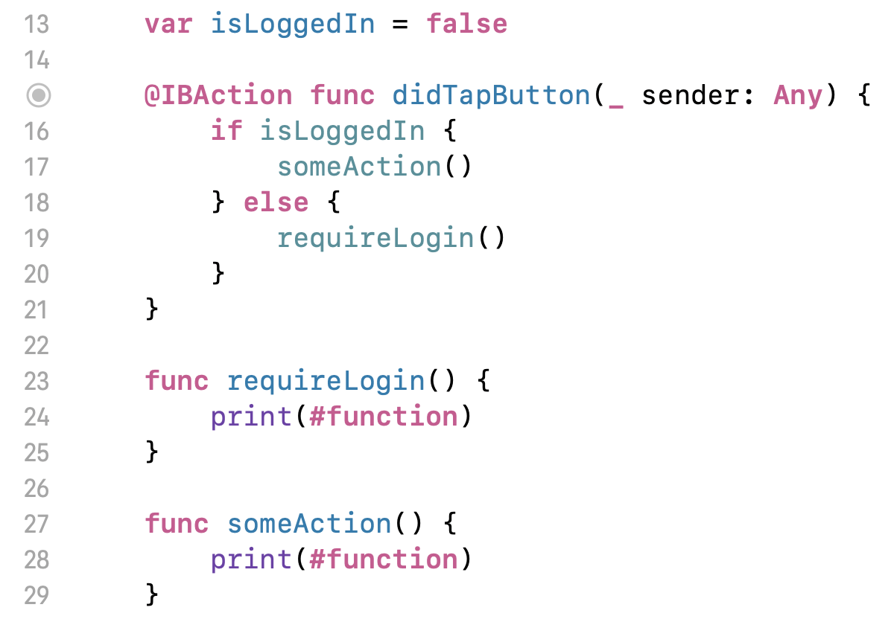
]

---

## Code Injection

* LLDB and Breakpoints

* Modify control flow without rebuild

.center[
	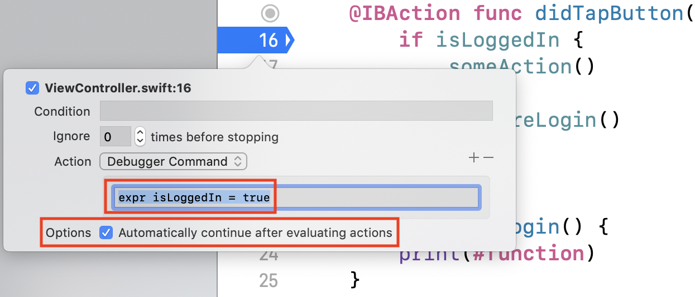
]

---

## Code Injection

* LLDB + REPL

* Read-Eval-Print-Loop (REPL)

* Access public functions and global variables

* Inject new functions

---

## Code Injection

* Example

.center[
	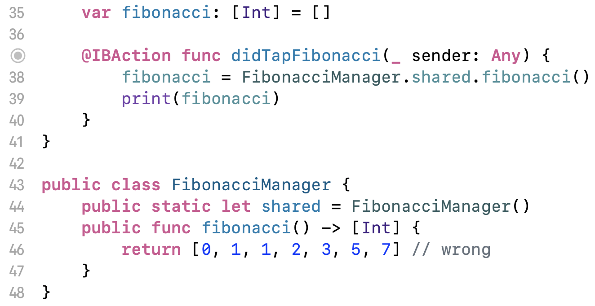
]

---

## Code Injection

* Type `repl` to enter

.center[
	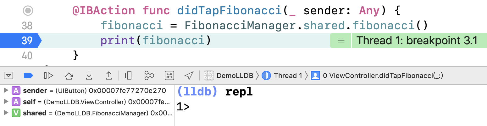
]

--

* Inject new function

.center[
	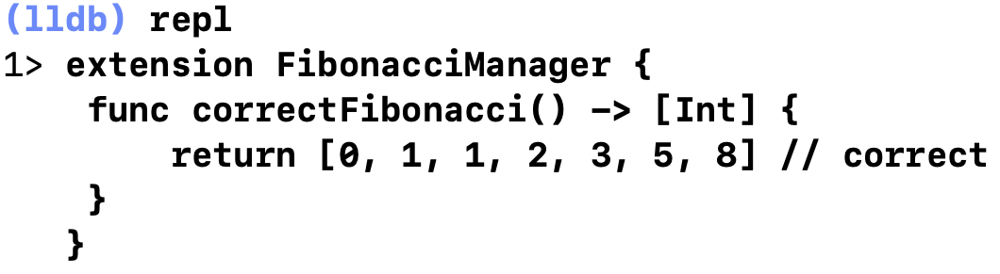
]

---

## Code Injection

* Call the function and verify

.center[
	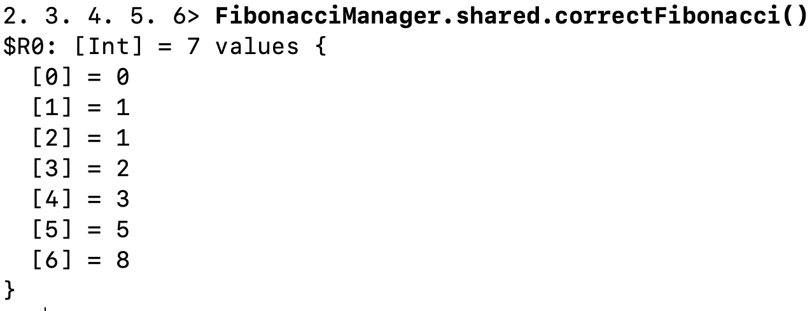
]

--

* Prefix `:` to run LLDB command

.center[
	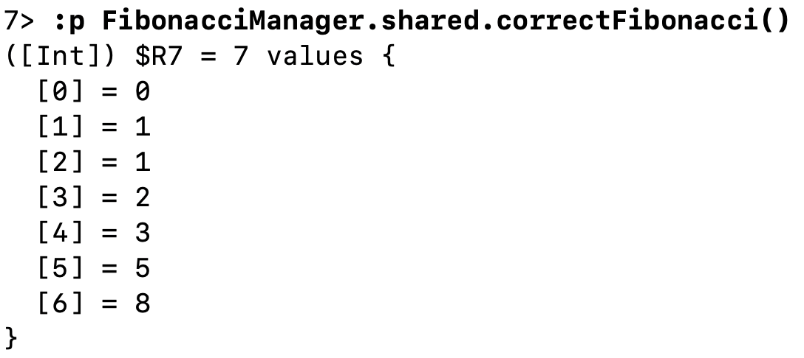
]

---

## Code Injection

* Type single colon to return back to LLDB 

.center[
	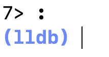
]

--

* Modify variable by calling the injected function

.center[
	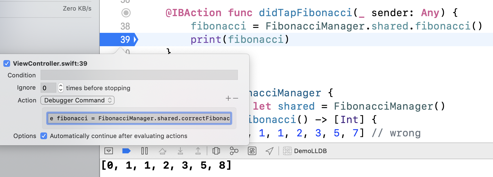
]

---

## Happy Coding

.vertical-center.center[
# Thank you
]
