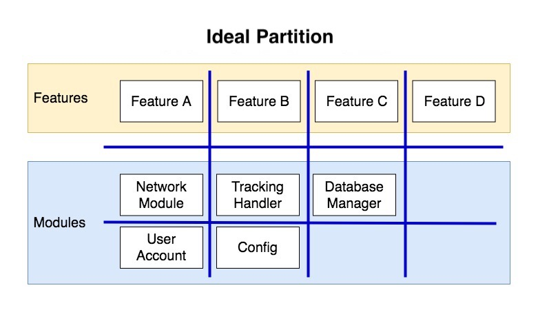

class: title

# The Survival Guide of Building Huge App

10x Faster Dev/Verification Cycle

CJ Lin

---

## Let's do a little survey...
--

### Can't tolerate LONG BUILD TME?
--

### Let's solve it !!!

---

## About me

.left-column-80[
```swift
struct Profile {

    let name = "CJ Lin"

    var identity = "iOS Nerd"

    var company = "LINE"

    var blog = "https://ejameslin.github.io"

    var line = "ejameslin"

    var twitter = "@eJamesLin"

}
```
]

.right-column-20[

]

???

List of App

---

## My daily experience...

---

## Outline

### Framework + Playground

### LLDB

---

## Partitioning is Hard

.center[
	
]

---

## Partitioning is Hard

.center[
	
]

---

## Partitioning is Hard

.center[
	
]

---

## Coordinator / Router

---

## Dependency Injection

---

## Build and Run no more!

.vertical-center.center[
# Thank you
]
